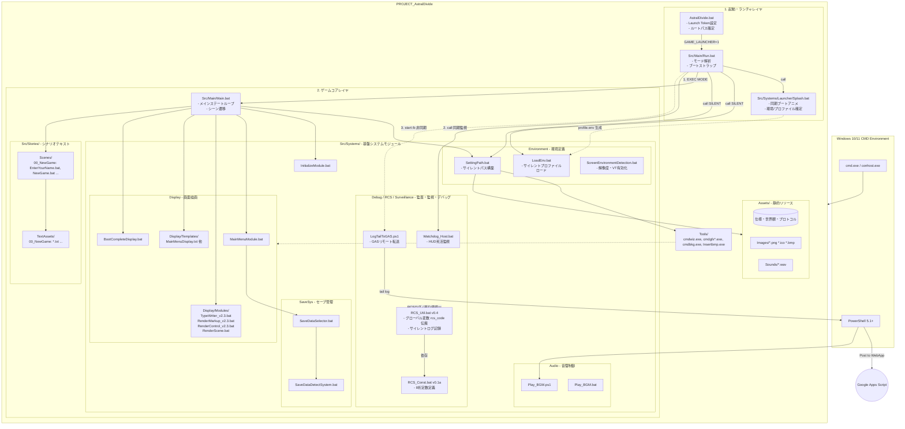

# Astral Divide Overall Layer & Module Architecture Diagram

**Project:** PROJECT_AstralDivide  
**Status:** Stable / Updated  
**Date:** 2026-05-31  

---

## 4. 主なアーキテクチャの変更点

- **RCS (Return Code System) 基盤の統合**:
  `RCS_Util.bat` v0.4 および `RCS_Const.bat` が `Debug` モジュールに統合され、ゲーム内のすべての戻り値判定、サイレントログ・エラーログ記録を一元管理しています。
- **Watchdog の同期 call 常駐**:
  通常起動時、`Run.bat` は `Main.bat` を非同期起動した直後、`Watchdog_Host.bat` を `call` で同期実行し、ゲーム本体プロセスの死活監視 HUD を常駐させます。
- **リモートログ転送 (`LogTailToGAS.ps1`)**:
  `-mode remote` 起動時、セッションログファイルから GAS への転送を担う `LogTailToGAS.ps1` が PowerShell を介してバックグラウンドで非同期実行される流れを追加しました。
- **Splash から親スコープへのサイレントロード**:
  `Splash.bat` が初期化を終えた後、`LoadEnv.bat` および `SettingPath.bat` をサイレントに `Run.bat` の親コンソールに呼び出すことで、二重ログを抑止しながら環境変数をエクスポートする構成に進化しています。
