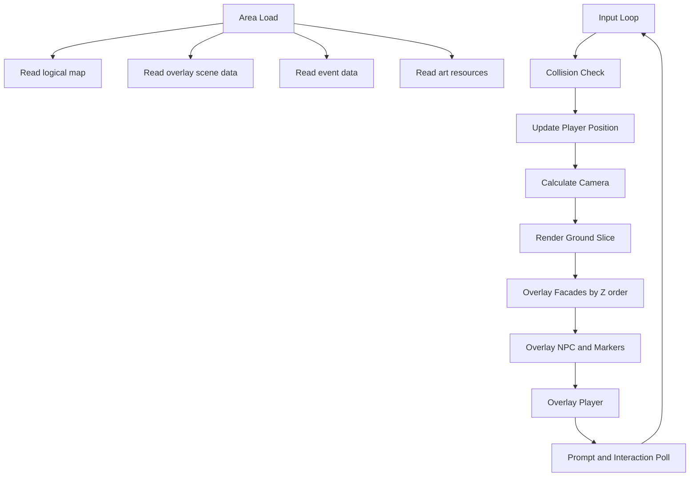

# Astral Divide - Map System Specification (Chapter 1 Town Revision v1.1)
本ドキュメントは、第一章の王都エリュシオン探索を前提にした「疑似3D町マップシステム」の実装仕様書である。

---

## 1. 目的

このシステムの目的は、単なるASCII平面マップではなく、

**「王都で暮らしている一人の少年として、城下町を歩き回る体験」**

をCMD上で成立させることである。

そのため、以下を重視する。

1. Chapter 1 の生活感を出せること。
2. 酒場のおつかい、宴の準備、仲間候補との顔見せなどの軽い寄り道を自然に置けること。
3. 王城や門、酒場、市場などを平面記号だけで済ませず、疑似3Dのランドマークとして見せられること。
4. 将来的に同じ仕組みを王都外周や軍施設にも流用できること。

---

## 2. デザイン方針

従来案の `#` と `.` 中心のスクロールマップだけでは、Chapter 1 に必要な「華やかさ」「生活感」「王都の格」が不足する。

したがって、町探索は以下の二層構造で考える。

1. **移動判定用の論理マップ**
   * 当たり判定、進入不可、水場、出入口、トリガー判定だけを持つ。
2. **表示用の演出レイヤ**
   * 建物の正面絵、門、城壁、噴水、屋台などを複数行の文字アートで上書き表示する。

つまり、プレイヤーは2D座標上を移動するが、見た目は疑似3Dの街並みに寄せる。

---

## 3. Chapter 1 で必要な体験

第一章「王都に生きる者」の前半では、以下の導線を町探索に載せられる必要がある。

### 3-1. 必須導線

1. 主人公の家から外へ出る。
2. 城下町を歩き、成人祝いの空気を感じる。
3. 酒場または広場に向かう流れを作る。
4. 成人祝いの準備に関わる軽い依頼を任意で受けられる。
5. 仲間候補や兵士、子供、市場の店主などと交流できる。

### 3-2. 任意寄り道

1. 酒場の仕込み手伝い。
2. 宴会用の買い出し。
3. 市場の荷物運搬。
4. 広場の飾り付け。
5. 仲間候補との初会話イベント。
6. 城門兵との雑談。

### 3-3. 街の空気として必要な要素

1. 王城が遠景または上部に見えていること。
2. 城門と城下町が視覚的に分かれていること。
3. 酒場、市場、広場、噴水など「行く理由のある場所」が見た目で判別できること。
4. NPCが機能記号ではなく、生活の一部として配置されていること。

---

## 4. 表示仕様

### 4-1. 基本思想

表示は「全面を記号で埋める方式」ではなく、以下の合成で構成する。

1. 地面レイヤ
   * 石畳、土道、水場などを1文字単位で描画する。
2. 建物フットプレートレイヤ
   * 当たり判定に使う建物の占有範囲。
3. ファサードレイヤ
   * 建物や門の外観を複数行アートで重ねる。
4. イベント/NPCレイヤ
   * NPC、ショップ入口、調査ポイント、クエストマーカー。
5. プレイヤーレイヤ
   * 主人公。

### 4-2. 疑似3Dランドマーク

王城や大型建物は、1マス1文字の平面図ではなく、ワールド座標にアンカーされた複数行アートとして描画する。

例:

```text
        城
      /####\
     /######\
    /########\
   /##########\
  /____門前____\
```

この種のアートは、単なる装飾ではなく以下を担う。

1. 遠景として王都の中心性を見せる。
2. プレイヤーの進行方向を自然に示す。
3. Chapter 1 の時点で「この街は守る価値がある」と感じさせる。

### 4-3. 建物の見せ方

酒場、店、市場、詰所などは、従来の `[General Store]` のようなラベル直書きではなく、

1. 屋根
2. 壁
3. 看板
4. 入口

を持つ小型アートとして表現する。

例:

```text
    /\____/\
   /  酒場  \
  |  Tavern |
  |   __    |
  |  |  |   |
```

文字列ラベルは補助情報に留め、建物の種類が形で分かるようにする。

---

## 5. データ構造

### 5-1. 論理マップ (`.map`)

`.map` は移動判定用のベースグリッドとして扱う。

* `#` : 建物フットプレート / 壁 / 障害物
* `.` : 歩行可能床
* `=` : 橋 / 境界
* `~` : 水
* `+` : ドア前判定
* `>` : 画面遷移出口
* `<` : 画面遷移入口

このファイルに見た目の豪華さを背負わせない。

### 5-2. 演出レイヤ (`.scene` or `.overlay`)

疑似3D表示のため、マップとは別に演出定義ファイルを持つ。

推奨フォーマット:

`ANCHOR_X,ANCHOR_Y,KIND,RESOURCE_ID,Z`

例:

```text
40,2,LANDMARK,CastleFar,10
12,8,BUILDING,TavernFront,20
28,10,BUILDING,MarketStall_A,20
53,9,OBJECT,Fountain,15
```

意味:

1. `ANCHOR_X, ANCHOR_Y`
   * ワールド座標上の基準位置。
2. `KIND`
   * `LANDMARK`, `BUILDING`, `OBJECT`, `DECORATION` など。
3. `RESOURCE_ID`
   * 複数行アート定義名。
4. `Z`
   * 重ね順。

### 5-3. アート定義 (`.art`)

ランドマークや建物外観は再利用可能な部品として分離する。

例:

```text
[CastleFar]
        城
      /####\
     /######\
    /########\

[TavernFront]
    /\____/\
   /  酒場  \
  |  Tavern |
  |   __    |
```

同じ建物でも章ごとに看板や装飾だけ差し替え可能にする。

### 5-4. イベント (`.event`)

既存の `SHOP`, `NPC`, `TRANSFER`, `TRIGGER` に加え、町探索向けに以下を追加する。

1. `QUEST`
   * 軽いおつかい開始。
2. `QUEST_STEP`
   * 納品、報告、中間確認。
3. `PARTY`
   * 仲間候補との加入前イベント。
4. `SCENE`
   * 広場演出、宴準備、群衆会話などの簡易シーン起動。
5. `POINT`
   * 調べるポイント。噴水、掲示板、飾り、積荷など。

例:

```text
18,9,QUEST,TavernPreparation
33,12,POINT,FountainTalk
52,8,PARTY,CompanionPreview_A
61,14,SCENE,EveningPlazaSetup
```

---

## 6. 探索構造

### 6-1. マップ分割

王都全域を1枚に押し込むより、以下のように区切る。

1. 主人公の家周辺
2. 中央広場
3. 市場通り
4. 酒場前通り
5. 城門前
6. 王城外郭

それぞれを `Monster Hunter` 風の軽いエリア遷移で繋ぐ。

理由:

1. CMD描画負荷を抑えやすい。
2. 各エリアごとに見せたい景色を強く作れる。
3. イベント管理が章進行と相性が良い。

### 6-2. 城下町での見せ場

各エリアには最低1つ、視覚的な主役を置く。

1. 家周辺: 生活感のある住宅列。
2. 中央広場: 噴水と宴の飾り。
3. 市場通り: 屋台、荷車、買い物客。
4. 酒場前: 看板、樽、仕込みの気配。
5. 城門前: 門兵、旗、王城遠景。

---

## 7. レンダリング仕様

### 7-1. 基本フロー



### 7-2. カメラ

プレイヤー中心のスクロールを基本とするが、ランドマークを見せたい場所ではカメラ補正を許容する。

例:

1. 城門前では上方向に少し余白を取り、王城遠景を見せる。
2. 広場では左右を広く取り、賑わいを見せる。

### 7-3. 重ね順

描画順は以下を基本とする。

1. 地面
2. 道路装飾
3. 建物ファサード
4. 背の低いオブジェクト
5. NPC / マーカー
6. プレイヤー
7. 前景装飾

将来的には「プレイヤーが門をくぐる」「建物のひさしが手前に被る」表現も可能にする。

---

## 8. Chapter 1 向けイベント設計指針

### 8-1. 酒場おつかいクエスト

最初の軽い寄り道として適している。

想定フロー:

1. 酒場主人に話しかける。
2. 宴の準備で足りない品を頼まれる。
3. 市場または別の店へ向かう。
4. 帰還して報告。
5. 夜の宴イベントで会話が少し増える。

必要イベント:

1. `QUEST,TavernPreparation`
2. `QUEST_STEP,BuyWine`
3. `QUEST_STEP,BringBread`
4. `SCENE,TavernBusy`

### 8-2. 宴の準備

広場と酒場を使って「町が明日のために動いている」状態を見せる。

必要演出:

1. 飾り付け中のNPC。
2. 荷物や樽などのオブジェクト。
3. 会話内容の段階変化。
4. 夕方以降の差分表示。

### 8-3. 仲間候補の顔見せ

仲間加入はまだ先でも、Chapter 1 時点で印象を残す。

推奨配置:

1. 酒場で偶然会う。
2. 広場の手伝いで遭遇する。
3. 城門詰所で兵士系候補と接触する。

`PARTY` イベントは加入処理ではなく、会話フラグ管理に使う。

---

## 9. 実装上の注意

1. `.map` に豪華な建物名を直接埋め込まない。
2. 見た目の主役は `.overlay` と `.art` に持たせる。
3. デモ時点では大型ランドマークを2つ以上入れる。
4. プレイヤー誘導はクエストマーカーより「景色で行きたくなる配置」を優先する。
5. ASCIIだけで寂しい場合は、罫線、斜線、三角、全角文字、色付きANSIを積極的に使う。

---

## 10. 現時点の結論

現行の `DemoMap_ElysionTown.map` は、移動実験用のプロトタイプとしては有効だが、第一章の王都探索としては情報密度も演出密度も不足している。

次段階では以下を優先する。

1. 王都を「平面マップ」から「論理マップ + 疑似3D演出レイヤ」に変更する。
2. 酒場、市場、広場、城門の4拠点をChapter 1 用の主要POIとして作る。
3. 酒場のおつかいクエストと宴準備イベントを最初の町内ループとして成立させる。
4. 王城遠景または城門遠景を常に印象に残るランドマークとして表示する。

この方針なら、CMDベースでも「ちゃっちいASCIIマップ」ではなく、

**簡易ながら雰囲気のある王都探索**

として成立させやすい。
