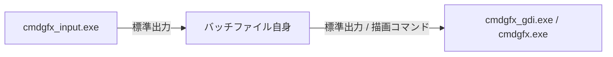

# バッチファイルでマウス操作を実現するための仕様書 (Usage)

このドキュメントでは、`cmdgfx_input.exe` を使用してバッチファイル（Windows Batch）からリアルタイムにマウス操作やキー入力を取得・処理する方法について解説します。

---

## 1. 全体構造と処理フロー (Overview)

通常のバッチファイルではコンソールのリアルタイムなマウス入力イベントを取得できません。このプロジェクトでは、以下の**3重パイプライン**を利用してイベントの取得、ゲームロジックの処理、画面の描画を分離して並行処理することで、入力を可能にしています。



### 基本的な処理の流れ：
1. **起動フェーズ**: 
   バッチファイルの初回起動時に自身をパイプラインの中間に配置し、`cmdgfx_input.exe` と `cmdgfx_gdi.exe`（または `cmdgfx.exe`）を同時に立ち上げます。
2. **イベント受信ループ**: 
   `cmdgfx_input.exe` が取得したキー/マウス/リサイズイベントが、標準入力（`set /p`）経由でバッチファイルに1行の文字列として送られてきます。
3. **描画とクリーンアップ**: 
   バッチファイル内でイベントをパースし、処理結果に基づいた描画コマンドを `echo` で標準出力に送り、描画サーバーである `cmdgfx` に描画させます。終了時には `cmdgfx_input` に終了シグナルを送ります。

---

## 2. cmdgfx_input.exe の仕様 (Specifications)

`cmdgfx_input.exe` は、Windows APIを用いてコンソールの入力バッファからイベントを監視し、それをパースしやすい1行のテキストフォーマットに変換して標準出力へ送信するユーティリティです。

### 起動引数 (Flags)
起動時に指定するオプション文字の組み合わせで挙動を制御します。

| フラグ | 説明 |
|---|---|
| `k` | 最後に押されたキーを転送する。 |
| `K` | キーが押されるのを待機（ブロック）してから転送する。 |
| `Wn` | 待機時間（nミリ秒）を設定する。ループ速度の調整に使用する。 |
| `m[wait]` | キー入力および**マウスクリック（押し下げ）**イベントを転送する。オプションでタイムアウト時間を指定可能。 |
| `M[wait]` | キー入力および**すべてのマウスイベント（移動、スクロール含む）**を転送する。オプションでタイムアウト時間を指定可能。 |
| `z[p]` | CPU負荷を下げるため、ビジーウェイトの代わりにスリープを使用する。`p` にスリープ割合（1〜100%）を指定可能。 |
| `u` | キーアップ（キーを離した）イベントの転送を有効にする。 |
| `n` | イベントが発生していないときも、`NO_EVENT` として空のフレームデータを送信する。 |
| `A` | 1回のウェイトの間に発生したすべてのイベントを順次送信する（バッファの全読み取り）。イベントストリームの終端には `END_EVENTS` が出力される。入力遅延（Input Lag）の低減に必須。 |
| `x` | 各メッセージの末尾を `-` で埋めて1024バイトにパディングする（バッチの `set /p` の読み込み安定化用）。 |
| `R` | ウィンドウのサイズ変更イベント（RESIZE_EVENT）を有効にし、現在のコンソール幅/高さを通知する。 |
| `i` | 実行時フラグ変更用のファイル `inputflags.dat` を無視する。 |
| `I` | ウィンドウタイトル経由でのコマンド入力を無視する。 |

*※ 例: `Am0unxW20` (すべてのバッファ処理、クリックのみ検知、キーアップ検知、非イベント送信、1024Bパディング、ウェイト20ms)*

### 実行中の制御 (Runtime Control)
バッチファイル側から `cmdgfx_input.exe` の動作を変更、または終了させる方法が2つ提供されています。

1. **ウィンドウタイトルの変更 (推奨)**:
   コンソールのウィンドウタイトルを `input:<フラグ>` に変更することで、実行中にフラグを設定できます。終了する時は `title input:Q` とします。
2. **`inputflags.dat` ファイルの書き込み**:
   バッチと同じディレクトリに `inputflags.dat` を作成し、フラグを記述します。例えば `echo Q > inputflags.dat` と書き込むと、`cmdgfx_input` がこれを検知して終了します。頭に `-` をつけるとフラグの無効化になります（例: `-W`）。

---

## 3. 出力テキストフォーマット (Data Format)

`cmdgfx_input.exe` は1フレーム（または1イベント）ごとに以下の形式のデータを1行で出力します。各項目はスペースで区切られています。

### イベントデータの例：
```text
KEY_EVENT 1 DOWN 1 VALUE 32  MOUSE_EVENT 1 X 12 Y 34 LEFT 1 RIGHT 0 LEFT_DOUBLE 0 RIGHT_DOUBLE 0 WHEEL 0  RESIZE_EVENT 0 W 150 H 75----------------- (パディング)
```

パースする際の各トークン（スペース区切りの単語）の位置は以下の通りです。

| トークン位置 | トークン名 | 格納される値 / 意味 |
|:---:|---|---|
| **1** | `EV_BASE` | 送信されたイベントの種別 (`KEY_EVENT`, `MOUSE_EVENT`, `RESIZE_EVENT`, `NO_EVENT`, `END_EVENTS`) |
| **2** | `K_EVENT` | キーイベントが発生したか (`0` または `1`) |
| **3** | (DOWN文字列) | 固定文字列 "DOWN" |
| **4** | `K_DOWN` | キーが押されたか離されたか (`0` = キーアップ, `1` = キーダウン) |
| **5** | (VALUE文字列) | 固定文字列 "VALUE" |
| **6** | `KEY` | キーコード (Ascii値、または 256 + 仮想スキャンコード) |
| **7** | (MOUSE_EVENT) | 固定文字列 "MOUSE_EVENT" |
| **8** | `M_EVENT` | マウスイベントが発生したか (`0` または `1`) |
| **9** | (X文字列) | 固定文字列 "X" |
| **10** | `M_X` | マウスカーソルのX座標 (文字セル単位) |
| **11** | (Y文字列) | 固定文字列 "Y" |
| **12** | `M_Y` | マウスカーソルのY座標 (文字セル単位) |
| **13** | (LEFT文字列) | 固定文字列 "LEFT" |
| **14** | `M_LB` | 左クリックが押されているか (`0` = 離されている, `1` = 押されている) |
| **15** | (RIGHT文字列) | 固定文字列 "RIGHT" |
| **16** | `M_RB` | 右クリックが押されているか (`0` = 離されている, `1` = 押されている) |
| **17** | (LEFT_DOUBLE) | 固定文字列 "LEFT_DOUBLE" |
| **18** | `M_DBL_LB` | 左ダブルクリックされたか (`0` または `1`) |
| **19** | (RIGHT_DOUBLE) | 固定文字列 "RIGHT_DOUBLE" |
| **20** | `M_DBL_RB` | 右ダブルクリックされたか (`0` または `1`) |
| **21** | (WHEEL文字列) | 固定文字列 "WHEEL" |
| **22** | `M_WHEEL` | ホイールスクロール状態 (`1` = 上スクロール, `-1` = 下スクロール, `0` = なし) |
| **23** | (RESIZE_EVENT) | 固定文字列 "RESIZE_EVENT" |
| **24** | `RESIZED` | ウィンドウサイズが変更されたか (`0` または `1`) |
| **25** | (W文字列) | 固定文字列 "W" |
| **26** | `SCRW` | 現在のコンソール幅 (文字数) |
| **27** | (H文字列) | 固定文字列 "H" |
| **28** | `SCRH` | 現在のコンソール高さ (文字数) |

---

## 4. バッチファイルでの実装テンプレート (Implementation Template)

以下は、バッチファイルでマウス操作を読み取り、コンソール上に描画・制御を行うための最小限のコードテンプレートです。
コピーして `.bat` ファイルとして保存し、`cmdgfx_input.exe` および `cmdgfx_gdi.exe`（または `cmdgfx.exe`）と同じフォルダに配置して実行してください。

```batch
@echo off
rem ========================================================
rem  Mouse Input Template for RPG project
rem  Encoding: UTF-8, Line-break: CRLF
rem ========================================================

rem Check if the process is already running in the pipeline
if defined __ goto :START
set __=.

rem Start the pipeline chain: Input -> Logic (this script) -> Output GFX
rem Flags: M13nW15xR (All Mouse, Non-event, Wait 15ms, Padding 1024B, Resize check)
cmdgfx_input.exe M13nW15xR | call %0 %* | cmdgfx_gdi.exe "" S

set __=
goto :eof

:START
setlocal ENABLEDELAYEDEXPANSION

rem Initialize variables
set /a M_X=0, M_Y=0, M_LB=0, M_RB=0
set /a KEY=0, K_DOWN=0
set STOP=

:LOOP
rem Run loop frame by frame (batch will process up to 300 cycles)
for /L %%1 in (1,1,300) do if not defined STOP (
    
    rem Read one line of input sent from cmdgfx_input.exe
    set /p INPUT=
    
    rem Parse the formatted event string using single "for /f" structure
    for /f "tokens=1,2,4,6, 8,10,12,14,16,18,20,22, 24,26,28" %%A in ("!INPUT!") do (
        set EV_BASE=%%A
        set /a K_EVENT=%%B, K_DOWN=%%C, KEY=%%D
        set /a M_EVENT=%%E, M_X=%%F, M_Y=%%G, M_LB=%%H, M_RB=%%I
        set /a M_DBL_LB=%%J, M_DBL_RB=%%K, M_WHEEL=%%L
        set /a RESIZED=%%M, SCRW=%%N, SCRH=%%O
    ) 2>nul

    rem Handle mouse click / movement event
    if !M_EVENT!==1 (
        rem Example logic: output draw command to cmdgfx_gdi
        rem Draw a pixel at current mouse position.
        rem If Left Button is pressed, use white color (f). Else gray (9)
        set COL=9
        if !M_LB!==1 set COL=f
        if !M_RB!==1 set COL=1
        echo "cmdgfx: pixel !COL! 0 db !M_X!,!M_Y!"
    )

    rem Handle key press event (Esc key to exit, keycode 27)
    if "!KEY!"=="27" if "!K_DOWN!"=="1" set STOP=1
)
if not defined STOP goto LOOP

rem Cleanup and shutdown cmdgfx_input and cmdgfx_gdi server gracefully
echo "cmdgfx: quit"
title input:Q
endlocal
goto :eof
```

### 実装のポイント：
1. **多重ループ回避と遅延防止**:
   `for /L %%1 in (1,1,300)` による制限ループを使用することで、バッチファイルの環境変数展開の限界やメモリリークを抑えつつ、`goto LOOP` でループを継続し安定したゲームループを実現しています。
2. **`2>nul` によるエラー抑制**:
   パース処理中に一時的に変数にゴミデータが入ったり数値として不正な値が入ったりした場合に、バッチファイルのエラー出力が描画用のパイプラインに混入して画面が崩れるのを防ぐために `2>nul` を指定しています。
3. **安全な終了**:
   終了時に `echo "cmdgfx: quit"` で描画サーバーを終了させ、さらに `title input:Q` で入力監視サーバー `cmdgfx_input` を終了させてゾンビプロセスが残らないようにしています。
